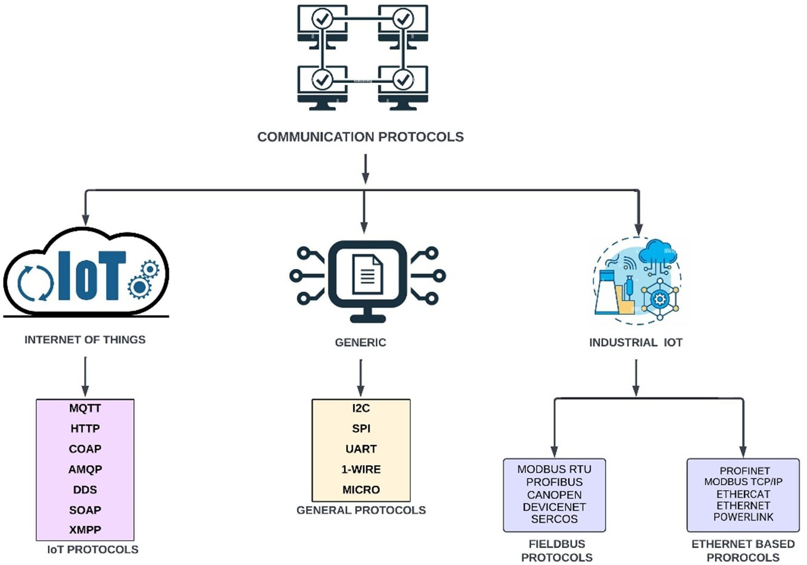

<h1 align="center">IoT Communication Protocols Documentation</h1>

MQTT • CoAP • HTTP • AMQP • DDS • SOAP • XMPP • LoRaWAN • Industrial & Embedded Communication

<b>Sree Harsha Kuragayala</b> 
Graduate Apprentice (2025) • Embedded Systems & IoT Engineering 
Central Manufacturing Technology Institute (CMTI), Bangalore

---

## Communication Protocol Architecture

This diagram categorizes communication protocols into:

- IoT Protocols  
- General Embedded Protocols  
- Industrial Fieldbus Protocols  
- Industrial Ethernet Protocols  

---

## Project Overview

The IoT Protocols Documentation project focuses on creating a comprehensive and structured reference for communication protocols widely used in Internet of Things (IoT) systems. As connected devices grow across industries—from smart homes and healthcare to manufacturing—the need for seamless and reliable communication becomes critical.

This documentation explains architecture, data exchange models, and protocol mechanisms, helping engineers choose the best protocol based on **power, speed, latency, reliability, and scalability**.

---

## Internet of Things (IoT)

IoT is a network of physical devices embedded with sensors and connectivity, enabling data exchange between machines, cloud systems, and users. It combines **embedded systems, cloud computing, big data, and analytics** to automate and optimize real-world processes.

---

## OSI Model

1. Physical Layer – Hardware transmission (cables, RF, fiber)  
2. Data Link Layer – Node communication & error detection  
3. Network Layer – Routing & addressing (IP)  
4. Transport Layer – Reliable transfer (TCP/UDP)  
5. Session Layer – Session management  
6. Presentation Layer – Encryption & translation  
7. Application Layer – End-user protocols (HTTP, MQTT)  

---

## IoT Architecture Layers

- **Perception Layer** – Sensors & Data Acquisition  
- **Network Layer** – Wi-Fi / BLE / LoRa Connectivity  
- **Processing Layer** – Edge / Gateway / Cloud  
- **Application Layer** – Monitoring & Control  

---

## Industrial IoT Communication Protocols

### Fieldbus Protocols

**MODBUS RTU** – Serial communication for SCADA and automation  
**PROFIBUS** – High-speed PLC communication  
**CANOPEN** – CAN-based industrial network  
**DEVICENET** – Device-level industrial communication  
**SERCOS** – Real-time motion control protocol  

### Industrial Ethernet Protocols

**PROFINET** – Real-time industrial Ethernet  
**MODBUS TCP/IP** – Ethernet-based Modbus communication  
**ETHERCAT** – Ultra-fast real-time automation  
**ETHERNET/IP** – Industrial Ethernet communication  
**POWERLINK** – Deterministic Ethernet for automation  

These protocols ensure **real-time, deterministic, and reliable industrial communication**.

---

## Protocol Comparison Charts

### Application Protocols

| Protocol | Power | Speed | Latency | Range | Reliability | Best Use |
|----------|------|------|---------|------|------------|----------|
| MQTT | Low | Medium | Low | Medium | High | IoT Monitoring |
| CoAP | Very Low | Medium | Low | Medium | Medium | Constrained Devices |
| HTTP | High | High | Medium | Medium | High | Cloud/API |
| AMQP | Medium | Medium | Medium | Medium | Very High | Enterprise |
| DDS | Medium | Very High | Very Low | Medium | Very High | Real-Time |
| SOAP | High | Low | High | Medium | High | Secure Systems |
| XMPP | Medium | Medium | Low | Medium | High | Messaging |
| LoRaWAN | Very Low | Low | High | Very Long | Medium | Remote IoT |

---

### Industrial Protocols

| Protocol | Type | Speed | Real-Time | Typical Use |
|----------|------|------|----------|-------------|
| MODBUS RTU | Serial | Low | No | SCADA |
| PROFIBUS | Fieldbus | High | Yes | PLC |
| CANOPEN | CAN | Medium | Yes | Embedded |
| DEVICENET | CAN | Medium | Yes | Industrial Devices |
| SERCOS | Motion | High | Yes | Robotics |
| PROFINET | Ethernet | High | Yes | Automation |
| MODBUS TCP/IP | Ethernet | Medium | No | Monitoring |
| ETHERCAT | Ethernet | Very High | Yes | Real-Time |
| ETHERNET/IP | Ethernet | High | Yes | Industrial |
| POWERLINK | Ethernet | High | Yes | Automation |

---

### Embedded Communication Protocols

| Protocol | Speed | Distance | Power | Use |
|----------|------|----------|------|-----|
| UART | Medium | Short | Low | Debug |
| I2C | Medium | Short | Low | Sensors |
| SPI | High | Short | Medium | ADC/DAC |
| 1-Wire | Low | Short | Very Low | Sensors |
| Microwave | Medium | Long | Medium | Wireless |

---

## Engineering Applications

- Industrial IoT Monitoring  
- Smart Energy Systems  
- Embedded Communication  
- Edge-to-Cloud Systems  
- Industrial Automation  

---

## Engineering Comparison & Protocol Selection Guide

### Application Layer Protocols — When to Use

| Protocol | When to Use | Where to Use |
|----------|-------------|-------------|
| MQTT | When low power, low bandwidth, and reliable publish–subscribe communication is required | IoT monitoring, smart energy systems, sensor-to-cloud communication |
| CoAP | When devices are constrained and need lightweight REST communication | Embedded sensor networks, low-power IoT devices |
| HTTP | When direct web/cloud integration and REST APIs are required | Cloud platforms, dashboards, web-connected IoT devices |
| AMQP | When guaranteed delivery and enterprise-grade messaging is required | Distributed systems, enterprise IoT platforms |
| DDS | When deterministic, real-time, and high-speed data exchange is needed | Robotics, industrial automation, mission-critical systems |
| SOAP | When secure, structured, and standardized messaging is required | Enterprise systems, secure data exchange platforms |
| XMPP | When real-time messaging and presence communication is required | Device-to-device communication, signaling, messaging systems |
| LoRaWAN | When very long-range and ultra-low-power communication is required | Remote monitoring, smart agriculture, smart cities |

---

### Industrial Communication Protocols — When to Use

| Protocol | When to Use | Where to Use |
|----------|-------------|-------------|
| MODBUS RTU | When simple, reliable serial communication is needed | SCADA systems, industrial monitoring |
| PROFIBUS | When deterministic and high-speed field communication is required | PLC networks, industrial automation |
| CANOPEN | When robust CAN-based communication is needed | Embedded automation, industrial controllers |
| DEVICENET | When device-level communication over CAN is required | Industrial devices, automation nodes |
| SERCOS | When real-time motion control is required | Robotics, CNC, servo systems |
| PROFINET | When real-time industrial Ethernet communication is required | Industrial automation, PLC control |
| MODBUS TCP/IP | When Ethernet-based monitoring and control is required | SCADA, remote monitoring |
| ETHERCAT | When ultra-fast deterministic communication is required | High-speed automation, robotics |
| ETHERNET/IP | When standard Ethernet-based industrial communication is needed | Industrial networks, automation |
| POWERLINK | When deterministic Ethernet communication is required | Real-time industrial automation |

---

### Embedded Communication Protocols — When to Use

| Protocol | When to Use | Where to Use |
|----------|-------------|-------------|
| UART | When simple asynchronous communication is needed | Debugging, device-to-device communication |
| I2C | When multiple sensors share a single communication bus | Sensor interfacing, peripheral communication |
| SPI | When high-speed communication with peripherals is required | ADC, DAC, memory, sensors |
| 1-Wire | When very low-power single-wire communication is sufficient | Simple sensors, identification devices |
| Microwave Communication | When long-distance wireless transmission is required | Industrial telemetry, remote communication |

---

## My Contribution

- Engineering analysis of IoT communication protocols  
- Architecture-level comparison and protocol selection study  
- Documentation of communication models and system integration  
- Applied knowledge from embedded and IoT development  

---

## Tools & Knowledge Domain

- Embedded Systems Engineering  
- IoT Architecture & Communication  
- MQTT / CoAP / HTTP / AMQP / DDS / LoRaWAN  
- Wireless Embedded Communication  
- Edge-to-Cloud System Design  

---

## Repository Scope

This repository contains **engineering documentation only**.  
It does not include proprietary firmware, industrial code, or confidential implementation.

---

## References

1. https://www.allaboutcircuits.com/technical-articles/internet-of-things-communication-protocols-iot-data-protocols/  
2. https://azure.microsoft.com/en-in/solutions/iot/iot-technology-protocols/  
3. https://www.barbara.tech/blog/iot-communication-protocols-you-should-know-about  
4. https://www.interviewbit.com/blog/iot-architecture/  
5. https://www.geeksforgeeks.org/architecture-of-internet-of-things-iot/  
6. https://www.geeksforgeeks.org/open-systems-interconnection-model-osi/  
7. https://dergipark.org.tr/tr/download/article-file/2213079  
8. https://www.researchgate.net/publication/312957467_Internet_of_Things_Architectures_Protocols_and_Applications  
9. https://www.javatpoint.com/computer-network-http  
10. https://www.geeksforgeeks.org/http-full-form/  
11. https://developer.mozilla.org/en-US/docs/Web/HTTP  
12. https://en.wikipedia.org/wiki/MQTT  
13. https://mqtt.org/  
14. https://www.geeksforgeeks.org/introduction-of-message-queue-telemetry-transport-protocol-mqtt/  
15. https://xmpp.org/about/technology-overview/  
16. https://www.geeksforgeeks.org/xmpp-protocol/  
17. https://www.microfocus.com/documentation/silk-performer/205/en/silkperformer-205-webhelp-en/GUID-FEFE9379-8382-48C7-984D-55D98D6BFD37.html  
18. https://www.geeksforgeeks.org/basics-of-soap-simple-object-access-protocol/  
19. https://www.dds-foundation.org/what-is-dds-3/  
20. https://en.wikipedia.org/wiki/Data_Distribution_Service  
21. https://www.wallarm.com/what/what-is-amqp  
22. https://www.geeksforgeeks.org/difference-between-amqp-and-http-protocols/  
23. https://www.wallarm.com/what/coap-protocol-definition  
24. https://www.emqx.com/en/blog/coap-protocol  
25. https://www.geeksforgeeks.org/constrained-application-protocol-coap/  

---

## Contact

Sree Harsha Kuragayala  
Graduate Apprentice (2025) • Embedded • IoT 
Email: sreeharsha.k83@gmail.com  

---

## License

Proprietary Portfolio License – View Only
